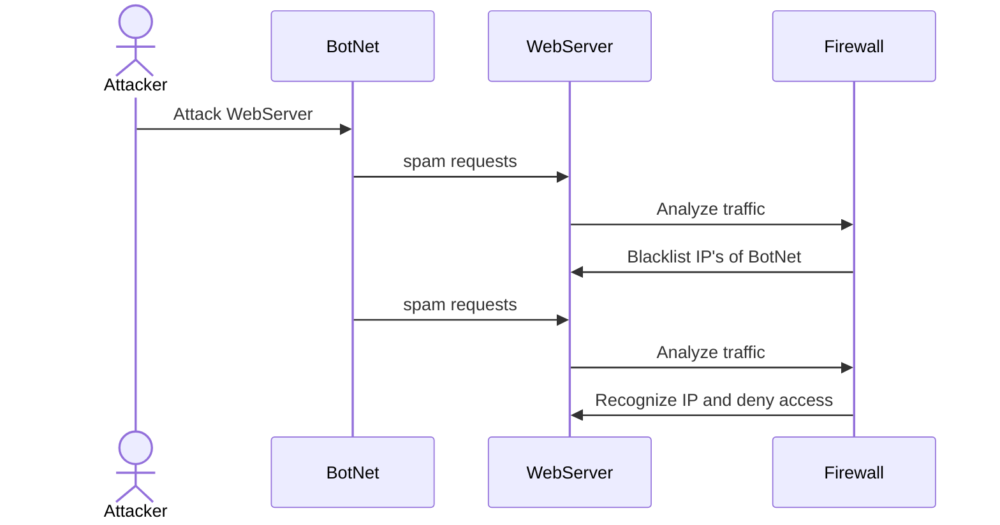

## In-depth analysis of the processes and contributions 

The Attacker sends a command to the botnet to attack the web server, leading the collection of bots to spam
the server with multiple requests each. On the web server's end, directing the traffic to the firewall to 
analyze the traffic to try and detect suspicious activity, and in this case, it does. After the firewall detects 
the attack it try's to blacklist(block) the IP's of as many attackers that it can recognize. 
Once the Ip is blacklisted further attempts from recognized to attackers on the server becomes null. 

